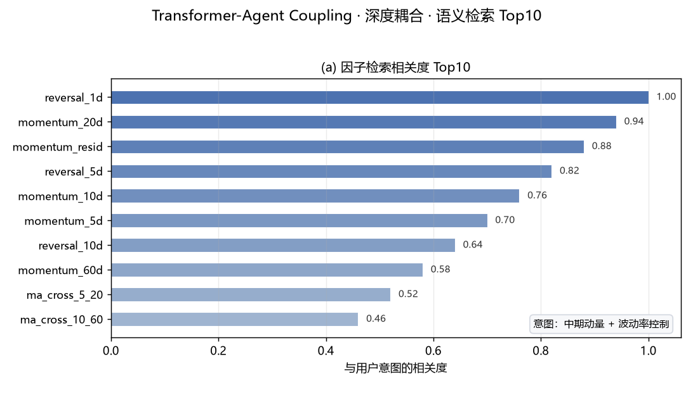

# FactorGPT — LLM-Powered Quantitative Factor Mining & Industrialization Platform

[](https://www.python.org/)
[](LICENSE)
[](https://hub.docker.com/)
[](https://streamlit.io/)
[](https://github.com/langchain-ai/langgraph)
[](https://huggingface.co/spaces/ZXTLQQ/factorgpt-demo)
[](https://github.com/ZXTLQQ/FactorGPT)
[](https://github.com/ZXTLQQ/FactorGPT/actions/workflows/ci.yml)

**FactorGPT** is an LLM-powered intelligent financial factor industrialization platform that deeply integrates natural language understanding with quantitative finance factor engineering. It supports automated factor extraction, validation, combination optimization, and production-grade deployment from both structured and unstructured data sources — all driven by natural language commands.

> **Keywords**: Quantitative Finance, Alpha Factor Mining, LLM Agent, Factor Backtesting, Factor Library, Genetic Programming, Reinforcement Learning, Alternative Data, Streamlit, A-Share, Financial AI, FactorGPT, Factor Refinery, RPN Engine, IC Analysis, Multi-factor Model, LangGraph, Python Quant, EastMoney Miaoxiang MX API, NeoData, Forward Testing, Headline Arena, CRPS, Operator Grid Miner, PIT Alignment, Sell-Side Research Reports, Factor Crowding

---

## Table of Contents

- [What Problem Does FactorGPT Solve?](#what-problem-does-factorgpt-solve)
- [Try It Online](#try-it-online)
- [Quick Start](#quick-start)
- [Project Highlights](#project-highlights)
- [Architecture Overview](#architecture-overview)
- [Data Sources & Configuration](#data-sources--configuration)
- [Docker Deployment](#docker-deployment)
- [Screenshots](#screenshots)
- [Environment Requirements](#environment-requirements)
- [Project Structure](#project-structure)
- [Testing & Quality Assurance](#testing--quality-assurance)
- [Roadmap](#roadmap)
- [Contributing](#contributing)
- [License](#license)
- [Disclaimer](#disclaimer)

---

## What Problem Does FactorGPT Solve?

Traditional quantitative factor research faces three major pain points: **high barrier to entry** (requires extensive domain expertise and programming skills), **slow iteration cycles** (manual factor design, coding, and backtesting loops take days to weeks), and **siloed workflows** (data, generation, evaluation, and deployment are disconnected).

FactorGPT addresses these challenges by:

1. **Natural Language to Factor Code**: Describe your investment idea in plain language, and the LLM Agent generates, validates, and backtests factor code automatically. The system includes a built-in knowledge base of 62 traditional factors as reference context.

2. **End-to-End Industrial Pipeline**: The "Six-Stage Factor Refinery" mimics an industrial smelting process — from raw data ore to finished factor products — with built-in quality control at every stage.

3. **Safety and Reliability**: A sandboxed execution environment with white-listed imports, lookahead bias detection (AST-based), automatic winsorization/neutralization/standardization, and out-of-sample validation ensures production-ready factor quality.

4. **Multi-Model Support**: Works with DeepSeek, OpenAI, Qwen, local Ollama models, and any OpenAI-compatible endpoint. The system auto-degrades gracefully when dependencies are missing, ensuring it runs in any environment.

---

## Try It Online

<p align="center">
  <a href="https://huggingface.co/spaces/ZXTLQQ/factorgpt-demo">
    
  </a>
</p>

FactorGPT provides a free online demo on HuggingFace Spaces — **no API keys, no sign-up, no installation required**. Describe your investment idea in natural language and see the factor go from code generation to backtest results in seconds. The demo includes: factor mining, 62-factor library browser, interactive IC charts, and a six-stage refinery pipeline walkthrough.

---

## Quick Start

### Prerequisites

- **Python**: 3.11 or higher
- **OS**: Linux, macOS, or Windows
- **Memory**: 8 GB RAM minimum (16 GB recommended for Transformer/RL modules)
- **Disk**: ~3 GB core install, ~5 GB if including model weights

### Option 1: Docker One-Click Deployment (Recommended)

```bash
# Clone the repository
git clone https://github.com/ZXTLQQ/FactorGPT.git
cd FactorGPT

# Build and start
docker-compose up -d

# Open browser at http://localhost:8501
```

The Docker image comes pre-configured with all dependencies, synthetic sample data, and a fully offline-capable demonstration environment. No API keys or network access required. See [Docker Deployment](#docker-deployment) for build-from-source options and environment variables.

### Option 2: Local Installation

```bash
# 1. Clone and enter directory
git clone https://github.com/ZXTLQQ/FactorGPT.git
cd FactorGPT

# 2. Create virtual environment (recommended)
python -m venv .venv
source .venv/bin/activate  # Linux/macOS
# .venv\Scripts\activate   # Windows

# 3. Install dependencies (locked versions for reproducibility)
pip install -r requirements.lock.txt

# 4. (Optional) Prefetch real market data for offline use
python scripts/prefetch_data.py

# 5. Launch the web interface
streamlit run src/ui/app.py
```

Open your browser at `http://localhost:8501` to access the 20-page integrated web dashboard.

### Quick Test (No Network Required)

```bash
# Single factor mining (offline, auto-fallback to synthetic data)
python run_agent.py "Build a 20-day momentum factor"

# Six-stage refinery pipeline (offline demo)
python run_agent.py --refinery "Mix daily and monthly frequency, combine short-term reversal with liquidity"

# Run preflight check (10-second health check for offline presentation readiness)
python scripts/preflight_check.py
```

### One-Command Simulation Demo

```bash
python demo_sim.py
```

Simulates the entire end-to-end factor pipeline on synthetic data — no network or API keys required — and outputs four realistic backtest charts under `demo_output/`: IC time series, quantile returns, long-short cumulative, and quantile cumulative returns.

---

## Project Highlights

### 1. Intelligent Factor Mining Agent (LangGraph Orchestration)

The core Agent follows a **Retrieve → Generate → Validate → Evaluate → Reflect** closed loop:

- **Knowledge Retrieval**: Searches factor knowledge base (ChromaDB + BGE embeddings, or jieba fallback) for relevant academic factor literature as LLM context
- **Factor Generation**: LLM generates factor code following strict safety protocols (`alpha_factor(df) -> DataFrame[date, symbol, factor]`)
- **Sandbox Validation**: Secure execution in isolated subprocess with timeout/memory limits, whitelist imports, and AST-based lookahead bias detection
- **Factor Post-processing**: Winsorization → Industry/Market-cap Neutralization → Standardization
- **Backtest Evaluation**: IC, RankIC, ICIR, IC positivity ratio, quantile returns, long-short Sharpe/MDD, turnover, coverage
- **Reflection & Improvement**: If IC threshold not met, LLM reflects on backtest metrics and iteratively improves the factor definition

See the backtest IC charts in [Screenshots](#screenshots).

### 2. Six-Stage Factor Refinery (Industrial Pipeline)

An end-to-end factor production line modeled after industrial smelting:

| Stage | Process | Component | Purpose |
|-------|---------|-----------|---------|
| PART-01 | Ore Warehouse | `FeatureForge` | 28 raw features + 50+ time-series/cross-sectional factor pools, multi-process parallel construction |
| PART-02 | Mining Layer | `TransformerEncoder` + `FactorRLSearch` + LLM | Transformer (d_model=128, 2 layers, 5 heads) vectorization + MaskablePPO factor combination search + LLM vein exploration |
| PART-03 | Grinding Workshop | `RPNEngine` | Rank IC/IR/ICIR quantification + stability assessment + parallel batch evaluation |
| PART-04 | Three-Tier Screening | `Screener` | LASSO de-redundancy → Human-AI collaborative review → TOP 10% cutoff |
| PART-05 | Alloy Blending | `AlphaPool` | ICIR-weighted + orthogonalization synthesis + leave-one-out overfitting test |
| PART-06 | Methodology Report | `MethodologyReport` | Automated methodology report (build logic/parameter justification/cross-validation), one-click MD + JSON export |

### 3. 62 Built-in Traditional Factors

A ready-to-use factor library covering five categories. Each factor includes name, category, tags, formula (Markdown + LaTeX), and reference Pandas implementation code. Supports search by category/keyword and batch export.


### 4. Enhanced Genetic Programming

Introduces three enhancements over traditional GP: **Factor Clusters** (maintain intra-cluster diversity), **Island Model** (multi-population independent evolution with periodic elite migration), and **Event Windows** (market-condition-triggered factor recombination/elimination). Built-in 15 operators (arithmetic, comparison, time-series, cross-sectional ranking).


*Panels: (a) per-cluster convergence, migration generations marked; (b) uniqueness vs. invalid-ratio; (c) real expression tree of the top factor; (d) per-cluster evolution gain; (e) OOS train-vs-test IC; (f) event-window weighted fitness. Rendered from the bundled offline data.

### 5. Unstructured Data Factor Mining

Extracts Alpha signals from multi-modal text data: `TextAnalyzer` (tokenization, entity recognition, sentiment quantification), `AlternativeDataManager` (supply chain, sentiment, satellite text), and `UnstructuredFactorIntegrator` (fusion with structured factors, incremental information contribution evaluation).


### 6. Transformer-Agent Deep Coupling

Deeply couples Transformer vector representations with the Agent's cognitive loop: `TransformerCoupling`, `CouplingScheduler`, `AgentContextBuilder`, and `AttentionVisualizer` form a "perception → reasoning → action" closed loop, significantly enhancing factor discovery depth and interpretability.



### 7. Local Deployment & Offline Resilience

- **Ollama Integration**: One-click script switches to local LLM (qwen2.5-coder:7b, llama3.1:8b, etc.) — no API key needed
- **Kronos Integration**: Financial time-series forecasting model as predictive factor enhancement
- **Graceful Degradation**: All heavy dependencies (Transformer, RL, ChromaDB) auto-degrade to numpy/heuristic/keyword fallbacks, ensuring zero-dependency-offline operation
- **Preflight Check**: Built-in health check script for conference presentation readiness
- **Data Caching**: Multi-source auto-fallback (EastMoney → Sina → Tushare → THS → Synthetic), with local cache for complete offline operation

See [Offline Data Source](#offline-data-source-built-in-no-network) for the bundled offline dataset.

### 8. Research Report Knowledge Pipeline (Tencent ima Integration)

FactorGPT keeps its factor knowledge base fresh by continuously watching a live sell-side research library through the Tencent **ima** open API. Three scripts under `scripts/` cover the full loop:

| Script | Role | Cost per run |
|--------|------|--------------|
| `ima_sync.py` | Pulls documents from **your own** ima knowledge base, chunks them, and feeds `data/knowledge/**/chunks.jsonl` + ChromaDB so the Agent can retrieve them | Depends on library size |
| `ima_keyword_watch.py` | **Lightweight watcher (recommended).** Runs `search_knowledge` against a curated keyword list and reports only reports that are new relative to a saved baseline | ~14-28 API calls |
| `ima_subscription_track.py` | **Full directory snapshot.** Walks the entire folder tree of a subscribed library and diffs it against the previous manifest | 350+ paged calls, resumable |

The watcher is the practical entry point. Against a 17,837-document subscribed research library, a full enumeration needs 350+ paged requests and reliably trips the account-level rate limit (`220021`), whereas keyword-targeted search costs roughly one request per keyword and finishes in seconds. Keyword selection matters: precise research terms such as `选股因子` or `量化择时` return a handful to a couple dozen documents, while broad category words such as `ETF` or `期权` return 100+ per page and drown the signal.

```bash
# First run: establish the baseline without reporting everything as "new"
python scripts/ima_keyword_watch.py --init --no-push

# Daily run: report only genuinely new reports, then commit and push the manifest
python scripts/ima_keyword_watch.py

# Adjust the watchlist
python scripts/ima_keyword_watch.py --add-keyword 因子拥挤度
```

Outputs land in `ima_subscription/`: `watch_keywords.json` (watchlist), `keyword_seen.json` (baseline), `keyword_hits.csv` (flat index), and `keyword_watch.md` (append-only log of new arrivals). Both scripts tolerate rate limiting by backing off and checkpointing, and `ima_subscription_track.py` resumes from the last completed folder on the next run instead of restarting the crawl.

Credentials go in `.env` as `IMA_CLIENT_ID` and `IMA_API_KEY` (issued at `ima.qq.com/agent-interface`, valid for one month). Note the API boundary: subscribed/shared libraries allow search but deny full-text export (`get_media_info` returns `220030`), so copying a report into your own library remains a manual step in the ima client — the pipeline reduces that to ticking items off a change list rather than browsing 17k documents.


### 9. Forward-Testing via Headline Arena (前瞻检验，独立于回测)

Factor validation (IC/IR backtests) is inherently **historical** — no matter how rigorous, it cannot answer "will this factor view still hold going forward?" FactorGPT closes that gap with a third-party, pre-committed forward-testing line through **Headline Arena** (`headlinearena.com`): the macro views embedded in factor-layer research (rates, style, commodity direction) are converted into daily probability predictions on global macro assets (gold `GC`, 10Y treasury `ZN`, WTI crude `CL`, E-mini S&P 500 `ES`, silver `SI`, copper `HG`, dollar `DXY`, …). Each prediction's settlement standard is **frozen at question creation**, predictions are **locked before the outcome exists**, and settlement is **mechanically scored by a third party** against real market data (directional: `50 ± confidence×50`; the platform also publishes per-agent CRPS/Brier calibration APIs). That makes the forward line the hardest-to-dispute form of evidence for factor validity.

```bash
# 1) One-time: register an HA agent (client_secret shown once, saved to ~/.headlinearena;
#    then a human claims the agent via claim_url + pairing_code)
python scripts/ha_forward_run.py register --name FactorGPT-GoldBot --bio "Gold macro view forward tests" \
    --model-provider DeepSeek --model-name deepseek-chat

# 2) Daily forward loop — turn a macro theme (or a factor methodology report) into locked predictions.
#    Default is dry_run: predictions are locked into the local ledger, no network/credentials required.
python scripts/ha_forward_run.py run --theme "避险情绪升温，降息预期增强，油价上行"
python scripts/ha_forward_run.py run --factor-report output/methodology_report.json
python scripts/ha_forward_run.py status                 # ledger state
python scripts/ha_forward_run.py scorecard              # accuracy / Brier / calibration card (Markdown)

# 3) Live submission (needs credentials + claimed agent; auto-subscribes asset scopes)
python scripts/ha_forward_run.py run --live --theme "油价上行，供给收紧" --assets GC,CL

# 4) Settlement backfill: pull third-party results into the ledger, then re-run scorecard
python scripts/ha_forward_run.py settle
```

Mechanics and guarantees: the bridge lives in `src/forwardtest/` (pure stdlib, zero new dependencies): `client.py` (register/auth/scope/challenges/predict/results/calibration), `translator.py` (deterministic macro-theme → asset/direction/confidence mapping), `ledger.py` (append-only JSONL under `data/forwardtest/`; prediction fields are frozen once settled), `scorecard.py` (directional accuracy, Brier vs the 1/3 random baseline, confidence-bucket calibration), and `runner.py` (orchestration). Every run degrades gracefully — no network, no credentials, or a factor description without macro wording simply skips or writes a local dry-run record, never an exception that breaks the factor pipeline. Optional integration: with `headline_arena.enabled: true` in `config.yaml`, the LangGraph agent appends a **shadow forward-test node** after `finalize`, folding each mined factor's description into a locked dry-run ledger record (agents never submit live predictions on their own). Credentials go in `.env` as `HA_AGENT_ID` / `HA_CLIENT_SECRET` (or `~/.headlinearena/credentials.json`); the platform is free, prediction rewards convert to LLM-gateway credits, and the plugin/API references are `github.com/headlinearena/headlinearena-agent-plugin` and `headlinearena.com/api/v1/agent/onboarding/guide.txt`.

### 10. Sell-Side Research Report Factor Framework (`src/mining/`)

`src/mining/` is a self-contained factor-research layer (~4,300 lines) that turns four sell-side methodology reports into a typed expression language, a PIT-safe panel, reproducible factor libraries, and a four-dimension evaluation that collapses to a single comparable score — fully offline, no LLM in the loop.

| Report | What landed |
|--------|-------------|
| 山西证券《算子网格搜索》 | 60 registered operators in six families (`elem` 10 / `elem2` 11 / `cs` 6 / `ts` 27 / `ts2` 5 / `cs2` 1); a **typed expression DSL** (`parse` / `validate` / `infer_type` / `render`, with commutativity-aware key de-duplication) whose dimension gate rejects unit-incoherent arithmetic (price + turnover, flags in `log`, …) at build time; an **operator grid miner** that searches operator × window × layer combinations under a hard evaluation budget; `evaluator.py`, which splits "is this factor good?" into **four dimensions** — data quality / predictive power / stability / correlation — and folds them into one weighted score *after* subtracting turnover-cost and expression-complexity penalties, because searching on IC alone is guaranteed to overfit; and `report.py`, which renders the whole run — layer-by-layer prune counts, per-factor scores, risk gate, correlations, incremental IC and the exact config — into a self-contained Markdown + JSON report |
| 天风证券《因子风险与拥挤》 | `risk.py`: exposure regression ΔR², Newey-West-adjusted t-stat, VIF, lag-1 autocorrelation, crowding score, and component risk contribution (components sum to portfolio vol) |
| 中信建投《"逐鹿"Alpha：量价 × 基本面统一框架》 | `fundamental.py`: PIT installation of quarterly financials; TTM expressed purely with existing operators (`add(add(x, ts_delay(x, 250)), add(ts_delay(x, 500), ts_delay(x, 750)))` = sum of four single-quarter values); 31 fundamental factors (quality / growth / leverage / accrual / valuation) plus cross-domain combination templates |
| 西部证券《概念数量因子》 | `concept.py`: interval-valid concept membership (differential counting, **no forward-fill**), concept count / niche / heat fields, 20 concept factors, and the **DGTW market-cap grouping operator** (`dgtw_cs`) that absorbs the non-linear part of the size relation which linear neutralisation leaves behind |

Anti-lookahead is enforced structurally rather than by convention:

- **`asof_align`** projects `announcement date + lag` onto trading days, and **`pit_reference`** re-derives the same series with a deliberately naive loop as an independent cross-check; `check_pit` compares them point by point *and* separately asserts "no value before the first visible day", so a shared bug cannot hide behind itself.
- **`lookback`** computes the mandatory warm-up window of any expression (`ts_mean(ts_delay(close, 250), 20)` → 269 days) and **`coverage_adj`** measures coverage *after* that warm-up — so "not enough history" is no longer misdiagnosed as "dead factor" (`check_history` fails loudly instead).
- **RankIC** ranks each variable cross-sectionally first, then correlates on the pairwise-complete sample (the pandas `rank → corrwith` convention). This definition is pinned by `tests/test_mining.py::test_cs_corr_rank_convention` so it cannot be silently "fixed" later.

```bash
python -m pytest tests/test_mining.py -q            # 32 tests, ~15 s, fully offline
python scripts/mining_report_demo.py                # one-command demo → demo_output/mining_report.md
```

The demo builds a synthetic panel, installs PIT fundamentals and concept memberships, runs a grid search, evaluates four representative factors from the three factor libraries, and writes `demo_output/mining_report.md` (+`.json`). No network, no API keys — the missing-value convention in the report is a hard rule: unmeasurable cells render as `—` and the JSON payload is written with `allow_nan=False`, so a `nan` can never masquerade as a real number.

---

## Architecture Overview

```
┌─────────────────────────────────────────────────────────────┐
│                  Streamlit Web UI (20 Pages)                  │
├─────────────────────────────────────────────────────────────┤
│              Factor Mining Agent (LangGraph)                  │
│        Retrieve → Generate → Validate → Evaluate → Reflect    │
├─────────────────────────────────────────────────────────────┤
│              Six-Stage Factor Refinery Pipeline               │
│       Ore → Mining → Grinding → Screening → Blending → Report │
├───────────────┬──────────────────┬───────────────────────────┤
│   LLM Layer   │    Data Layer    │       Engine Layer         │
│   DeepSeek    │    AKShare       │   Sandbox (Subprocess)     │
│   OpenAI      │    Tushare       │   Backtester (IC/Quantile) │
│   Ollama      │    Sina / THS    │   RPN Engine               │
│   vLLM        │    Baostock      │   Genetic Programming      │
│               │    MX Miaoxiang  │   Transformer / RL         │
│               │    NeoData       │                            │
├───────────────┴──────────────────┴───────────────────────────┤
│   Knowledge Base: ChromaDB + BGE Embeddings + 62 Factors     │
│   Experiment Tracking: MLflow / Local JSONL                   │
└─────────────────────────────────────────────────────────────┘
```

---

## Data Sources & Configuration

### Configuration

All settings are centralized in `config.yaml`:

- **llm**: Model provider (deepseek/openai/qwen/ollama), API key, endpoint, temperature, multi-LLM routing
- **data**: Primary data source, date range, caching, synthetic fallback. `data.source` accepts three values:
  - `offline` (**default**) — built-in bundled local dataset, no network required
  - `legacy` — self-crawled akshare/sina/tushare sources
  - `neodata` — platform stable data source (experimental, see below)
- **backtest**: Quantile count, commission rate, risk-free rate, chart output
- **rag**: Vector store toggle (ChromaDB+BGE or jieba fallback), embedding model, HF mirror
- **agent**: Max iterations, IC threshold, OOS validation
- **refinery**: Six-stage pipeline configuration (Transformer, RL, screening, AlphaPool)
- **proxy**: HTTP/HTTPS proxy for mainland China network environments
- **experiment_tracking**: Experiment logging (local JSONL or MLflow)
- **headline_arena**: Forward-testing of factor-layer macro views via Headline Arena (enabled toggles the LangGraph shadow node; `dry_run: true` keeps predictions local by default)

### NeoData Stable Data Source (Experimental)

FactorGPT can optionally route all market-data calls through the platform's **NeoData** service instead of self-crawling akshare/sina/tushare. The switch is unified behind a factory in `src/data/neo_adapter.py` (`get_data_source()`), so the four call sites (`graph.py`, `refinery.py`, `factor_system.py`, `market_data.py`) are unchanged and the **local `legacy` scheme is fully preserved** by default.

- **How to enable**: set `data.source: neodata` in `config.yaml`. The real gateway `base_url` is already filled in `config.yaml` (`data.neodata.base_url`).
- **Authentication**: requires the platform-scoped `tempToken`, which the platform writes to `~/.workbuddy/.neodata_token` (or the `NEODATA_TOKEN` env var). An ordinary IDE session token will be rejected with HTTP 401.

> **Important limitation — `fallback_to_legacy` must stay `true`.** NeoData is a **natural-language query** service: it returns free-text answer blocks (`data.apiData.apiRecall[].content`), **not** a structured bulk-data API. It therefore cannot reliably provide the structured datasets the factor engine needs — full daily-K-line time series (backtest core), complete index-constituent lists, industry/market-cap mappings, and structured financial statements. The adapter's `neo()` parsers are best-effort and return empty for these, so `fallback_to_legacy` is required to keep backtests runnable. In practice `neodata` currently serves only as a research-Q&A aid and **does not replace `legacy` for factor backtesting**. Live field validation was also blocked in this environment because the platform `tempToken` was not available (session token → 401). Revisit turning `fallback_to_legacy` off only after a valid `tempToken` is obtainable and structured parsing is proven.

### Offline Data Source (built-in, no network)

For a **fully offline** environment (no internet, flaky akshare/sina feeds, or deterministic backtesting), FactorGPT ships with a built-in local market dataset under `data/offline/` — cloned straight from the repository, no setup required. It is read through the `OfflineDataSource` adapter (`src/data/offline_adapter.py`), behind the same `get_data_source()` factory as `legacy`/`neodata` — so all four call sites (`graph.py`, `refinery.py`, `factor_system.py`, `market_data.py`) work unchanged.

- **How to enable**: set `data.source: offline` in `config.yaml` (default).
- **Data files** (bundled, commit-tracked): `data/offline/bars_<index>_part*.parquet` (daily bars, sharded so each file stays under 100 MB), `constituents_<index>.json`, `meta.json` (trade range, symbol/row counts). The default pool is `csi800` (~2016 symbols, 2019-01 ~ 2026-08, ~3.43M rows). After cloning, the dataset is ready to use — no download, no API key.
- **What it provides**: daily K-line (qfq-adjusted), index constituents, pct_chg — aligned with the `DataFetcher` column contract (`date/symbol/open/high/low/close/volume/amount/pct_chg`).
- **Physical vs contract schema**: the bundled parquet files store the code column physically as `instrument` (e.g. `sh.600000`); `offline_adapter.py` bridges it to the downstream `symbol` contract via `_de_norm_symbol()` (`instrument→symbol` rename). Never consume `instrument` directly outside the adapter — the documented data contract for all factor/backtest code is `symbol`.
- **What it does not provide**: industry/market-cap/financial/news fields, so neut/alternative-data dimensions degrade gracefully to empty — the factor pipeline still runs on pure price-volume data.
- **UI**: the sidebar "数据源设置" panel has an `offline` option plus a live status readout (trade range, symbol/row counts from `meta.json`).


### EastMoney MX (妙想) Data Interface

An official supplement to the NeoData channel: the EastMoney "Miaoxiang" (妙想) open API provides six data capabilities — market/fundamental queries (`data`), news & research search (`search`), smart stock screening (`xuangu`), watchlist management (`zixuan`), simulated portfolio (`moni`), and financial community content (`poster`). It is a reliable replacement for fragile self-crawled akshare/sina feeds.

- **Skill packages**: bundled at `factorgpt-skill/skills/mx-*/` (official releases, one `SKILL.md` + script per package). API reference: https://marketing.dfcfw.com/res/download/A620260623NIYC2U.md
- **API key (never commit it)**: set `MX_APIKEY` in your local `.env` (git-ignored) or as a persistent env var (`setx MX_APIKEY "..."` on Windows). The committed `.env.example` keeps `MX_APIKEY=` empty for users to fill in themselves.
- **Usage**: the cross-platform wrapper `scripts/mx_query.py` injects the key automatically and writes outputs to `output/mx_data/`:

```bash
python scripts/mx_query.py data "上证指数今日行情"
python scripts/mx_query.py search "白酒板块研报"
python scripts/mx_query.py xuangu "市盈率低于10的银行股"
python scripts/mx_query.py --list
```

> The official scripts default to a Linux output path (`/root/.openclaw/workspace/mx_data/output/`); on Windows either pass an explicit output dir or use the `mx_query.py` wrapper.

### Offline & Conference-Ready

FactorGPT is designed for reliable offline demonstrations:

```bash
# Step 1: Prefetch real data (with network)
python scripts/prefetch_data.py

# Step 2: Run health check
python scripts/preflight_check.py --offline

# Step 3: Disconnect network and run
streamlit run src/ui/app.py
python run_agent.py --refinery "Momentum + Quality factors"
```

The system checks five risk categories: RL dependencies, local Ollama models, cached market data, ChromaDB availability, and sandbox stability — all with clear pass/fail/warn outputs.

---

## Docker Deployment

### Build from Source

```bash
docker build -t factorgpt:latest .
docker run -d -p 8501:8501 --name factorgpt factorgpt:latest
```

### Docker Compose Configuration

The included `docker-compose.yml` provides:
- Persistent volume for data cache and ChromaDB
- Environment variable configuration for API keys and data sources
- Automatic port mapping (8501 for Streamlit)
- Resource limits (4 GB memory, 2 CPU cores) to keep demo environments light — raise the memory cap for Transformer/RL workloads

### Environment Variables

| Variable | Description | Default |
|----------|-------------|---------|
| `DEEPSEEK_API_KEY` | DeepSeek API key | - |
| `TUSHARE_TOKEN` | Tushare Pro token | - |
| `FACTORGPT_LLM_PROVIDER` | Override LLM provider | ollama |
| `FACTORGPT_LLM_MODEL` | Override LLM model | qwen2.5-coder:7b |
| `HF_ENDPOINT` | HuggingFace mirror endpoint | https://hf-mirror.com |
| `MX_APIKEY` | EastMoney Miaoxiang (妙想) API key, see "EastMoney MX" section | - |
| `IMA_CLIENT_ID` | Tencent ima client ID for the research-report pipeline | - |
| `IMA_API_KEY` | Tencent ima API key (renew monthly at ima.qq.com/agent-interface) | - |
| `HA_AGENT_ID` | Headline Arena agent id (forward-testing bridge; also saved to ~/.headlinearena/credentials.json) | - |
| `HA_CLIENT_SECRET` | Headline Arena client secret (shown once at registration) | - |

---

## Screenshots

### Backtest Analysis Charts

<p align="center">
  
  
</p>

<p align="center">
  
  
</p>

<p align="center">
  
  
</p>

### Web Interface Screenshots

<p align="center">
  
  
</p>

<p align="center">
  
  
</p>

---

## Environment Requirements

| Requirement | Minimum | Recommended |
|-------------|---------|-------------|
| Python | 3.11 | 3.12+ |
| RAM | 8 GB | 16 GB |
| Disk Space | 3 GB | 5 GB (with model weights) |
| GPU | Not required | CUDA-compatible GPU for Transformer/RL |
| OS | Linux / macOS / Windows | Ubuntu 22.04+ |

### Optional Dependencies

- **LLM Backend**: Ollama (local), DeepSeek API, OpenAI API, or any OpenAI-compatible endpoint
- **Data Sources**: AKShare (free, no registration), Tushare Pro (free token), Baostock (free), EastMoney MX Miaoxiang API (key required), NeoData (platform service)
- **Heavy Modules**: PyTorch (Transformer encoder), stable-baselines3 + sb3-contrib (MaskablePPO), MLflow (experiment tracking) — all auto-degrade if missing

---

## Project Structure

```
FactorGPT/
├── src/
│   ├── agent/          # LangGraph Agent (graph, nodes, state, integration)
│   ├── engine/         # Factor builder, backtester, optimizer, traditional factors
│   ├── data/           # Data fetcher, cleaner, feature forge, offline/neo adapters
│   ├── pipeline/       # Six-stage refinery pipeline
│   ├── mining/         # Report-driven factor layer (typed DSL, PIT panel, ops grid miner)
│   ├── rag/            # Knowledge base (ChromaDB + retrieval)
│   ├── llm/            # LLM client (DeepSeek/OpenAI/Ollama compatible)
│   ├── ui/             # Streamlit web interface (20 pages)
│   ├── store/          # SQLite persistence (memory, chat, experiments)
│   ├── forwardtest/    # Headline Arena forward-testing bridge (client/ledger/scorecard)
│   └── kronos/         # Kronos financial forecasting model integration
├── scripts/            # Utilities (data prefetch, health check, mx_query, ima sync/watch, ha_forward_run)
├── tests/              # Test suite (sandbox & lookahead, refinery, mining, forward test, docs contract)
├── factorgpt-skill/    # Agent skill packages (SKILL.md + official EastMoney MX skills)
│   ├── skills/         # mx-data / mx-search / mx-xuangu / mx-zixuan / mx-moni / mx-poster
│   └── references/     # Data contract (legacy / NeoData / offline field mapping)
├── third_party/        # Third-party integrations (kronos, ima client)
├── hf_space/           # HuggingFace Spaces static hosting files
├── .github/workflows/  # CI (pytest on Python 3.11 + 3.12, then compile check)
├── docs/               # Ablation report + docs/assets screenshots and charts
├── data/               # Sample data, factor library, bundled offline dataset, forward-test ledger
├── ima_subscription/   # Research-report watchlist, baseline, and change log
├── demo_output/        # One-command demo backtest charts (python demo_sim.py)
├── config.yaml         # Main configuration file
├── run_agent.py        # CLI entry point
├── demo_sim.py         # One-command end-to-end demo simulation
├── Dockerfile          # Docker build file
├── docker-compose.yml  # Docker Compose orchestration
├── requirements.txt    # Python dependencies
└── requirements.lock.txt  # Locked dependencies with hashes (reproducible)
```

---

## Testing & Quality Assurance

FactorGPT's "production-grade" claim is backed by automated tests and reproducible experiments, not just a badge — 101 test functions across 7 files, none of which require network access:

- **CI**: `.github/workflows/ci.yml` runs the full test suite on every push/PR (Python 3.11 + 3.12), then compile-checks all source modules. Status: [](https://github.com/ZXTLQQ/FactorGPT/actions/workflows/ci.yml)
- **Core tests**: sandbox security & lookahead-bias rejection (`test_sandbox.py`, 15 test functions / 24 cases including parametrized future-column names), the six-stage refinery pipeline end-to-end (`test_refinery.py`, 6), and documentation-contract drift guards (`test_docs_contract.py`, 6 — keeps README page/factor counts, the `instrument→symbol` data contract, and `kronos.fallback_to_stub` from silently drifting).
- **Backtest math & engineering glue** (`test_backtest.py`, 8 / `test_engineering.py`, 5): IC and rank-IC sign conventions, turnover consistency, lookahead detection on unshifted or negatively-shifted prices, an AlphaLens cross-check, plus experiment tracking, GP mining, LLM routing, batch evaluation and HPO.
- **Forward-testing bridge** (`test_forwardtest.py`, 29): the deterministic macro-theme → asset/direction/confidence translation, append-only ledger semantics with prediction fields frozen once settled, scorecard math (directional accuracy, Brier against the 1/3 random baseline, confidence-bucket calibration), and the guarantee that a missing network, missing credentials, or a theme without macro wording degrades to a local dry-run record rather than an exception.
- **Ablation experiments**: `python scripts/ablation_study.py --seed 42 --n-symbols 20` quantifies each pipeline module's marginal contribution on out-of-sample data (ΔICIR per module); results and interpretation in [docs/ablation_report.md](docs/ablation_report.md).
- **Report factor layer**: `tests/test_mining.py` (32 tests) pins the operator library against pandas / hand-computed references, the type-gate rejections, PIT alignment vs the independent reference implementation, warm-up-aware coverage, the risk-gate identities, grid-miner budget & reproducibility, the expected direction of every fundamental / concept factor, and the report renderer (every section present, `—` instead of `nan`, escaped table pipes, byte-identical output on write).
- **Warnings are errors** (`pytest.ini`): the failure mode this repo cares about is not a raised exception but an *exception silently swallowed into a plausible number* — `np.corrcoef` returning 0 for a degenerate cross-section, or `np.nanmean` warning on an empty slice and quietly yielding NaN. Every `RuntimeWarning` / `FutureWarning` / `DeprecationWarning` now fails the suite, so those substitutions cannot creep back in.

---

## Roadmap

- [x] Forward-testing channel for factor-layer macro views (Headline Arena; locked-before-outcome predictions, third-party settlement — see Highlight 9)
- [x] Report-driven factor layer built from four sell-side methodology reports (typed expression DSL, PIT-safe panel, operator grid miner, four-dimension evaluation — see Highlight 10)
- [ ] Multi-market support (US stocks, Hong Kong stocks, crypto)
- [ ] Real-time factor monitoring dashboard with alerting
- [ ] Factor decay analysis and lifecycle management
- [ ] Collaborative factor review workflow
- [ ] REST API for programmatic factor mining
- [ ] Integration with backtesting frameworks (Zipline, Backtrader)

---

## Contributing

Contributions are welcome! Please see the issues page for open tasks or submit a pull request with your improvements.

---

## License

This project is licensed under the MIT License. See the [LICENSE](LICENSE) file for details.

---

## Disclaimer

FactorGPT is an academic research tool for quantitative finance education and research purposes. It does not constitute financial advice. All factor outputs, backtest results, and investment signals are for reference only. Past performance does not guarantee future results. Users should make independent investment decisions based on their own risk tolerance and due diligence.

---

<p align="center">
  <b>FactorGPT</b> — Where Natural Language Meets Quantitative Finance<br>
  <sub>Built with ❤️ for the quantitative finance community</sub>
</p>
