# FactorGPT — LLM-Powered Quantitative Factor Mining & Industrialization Platform

[](https://www.python.org/)
[](LICENSE)
[](https://hub.docker.com/)
[](https://streamlit.io/)
[](https://github.com/langchain-ai/langgraph)
[](https://huggingface.co/spaces/ZXTLQQ/factorgpt-demo)
[](https://github.com/ZXTLQQ/FactorGPT)

**FactorGPT** is an LLM-powered intelligent financial factor industrialization platform that deeply integrates natural language understanding with quantitative finance factor engineering. It supports automated factor extraction, validation, combination optimization, and production-grade deployment from both structured and unstructured data sources — all driven by natural language commands.

> **Keywords**: Quantitative Finance, Alpha Factor Mining, LLM Agent, Factor Backtesting, Factor Library, Genetic Programming, Reinforcement Learning, Alternative Data, Streamlit, A-Share, Financial AI, FactorGPT, Factor Refinery, RPN Engine, IC Analysis, Multi-factor Model, LangGraph, Python Quant, EastMoney Miaoxiang MX API, NeoData

---

## What Problem Does FactorGPT Solve?

Traditional quantitative factor research faces three major pain points: **high barrier to entry** (requires extensive domain expertise and programming skills), **slow iteration cycles** (manual factor design, coding, and backtesting loops take days to weeks), and **siloed workflows** (data, generation, evaluation, and deployment are disconnected).

FactorGPT addresses these challenges by:

1. **Natural Language to Factor Code**: Describe your investment idea in plain language, and the LLM Agent generates, validates, and backtests factor code automatically. The system includes a built-in knowledge base of 62 traditional factors as reference context.

2. **End-to-End Industrial Pipeline**: The "Six-Stage Factor Refinery" mimics an industrial smelting process — from raw data ore to finished factor products — with built-in quality control at every stage.

3. **Safety and Reliability**: A sandboxed execution environment with white-listed imports, lookahead bias detection (AST-based), automatic winsorization/neutralization/standardization, and out-of-sample validation ensures production-ready factor quality.

4. **Multi-Model Support**: Works with DeepSeek, OpenAI, Qwen, local Ollama models, and any OpenAI-compatible endpoint. The system auto-degrades gracefully when dependencies are missing, ensuring it runs in any environment.

---

## 🚀 Try It Online — No Installation

<p align="center">
  <a href="https://huggingface.co/spaces/ZXTLQQ/factorgpt-demo">
    
  </a>
</p>

FactorGPT provides a free online demo on HuggingFace Spaces — **no API keys, no sign-up, no installation required**. Describe your investment idea in natural language and see the factor go from code generation to backtest results in seconds. The demo includes: factor mining, 62-factor library browser, interactive IC charts, and a six-stage refinery pipeline walkthrough.

---

## Quick Start

### Prerequisites

- **Python**: 3.11 or higher
- **OS**: Linux, macOS, or Windows
- **Memory**: 8GB RAM minimum (16GB recommended for Transformer/RL modules)
- **Disk**: ~5GB for dependencies + model weights

### Option 1: Docker One-Click Deployment (Recommended)

```bash
# Clone the repository
git clone https://github.com/factor-gpt/factor-gpt.git
cd factor-gpt

# Build and start
docker-compose up -d

# Open browser at http://localhost:8501
```

The Docker image comes pre-configured with all dependencies, synthetic sample data, and a fully offline-capable demonstration environment. No API keys or network access required.

### Option 2: Local Installation

```bash
# 1. Clone and enter directory
git clone https://github.com/ZXTLQQ/FactorGPT.git
cd FactorGPT

# 2. Create virtual environment (recommended)
python -m venv .venv
source .venv/bin/activate  # Linux/macOS
# .venv\Scripts\activate   # Windows

# 3. Install dependencies (locked versions for reproducibility)
pip install -r requirements.lock.txt

# 4. (Optional) Prefetch real market data for offline use
python scripts/prefetch_data.py

# 5. Launch the web interface
streamlit run src/ui/app.py
```

Open your browser at `http://localhost:8501` to access the 17-page integrated web dashboard.

### Quick Test (No Network Required)

```bash
# Single factor mining (offline, auto-fallback to synthetic data)
python run_agent.py "Build a 20-day momentum factor"

# Six-stage refinery pipeline (offline demo)
python run_agent.py --refinery "Mix daily and monthly frequency, combine short-term reversal with liquidity"

# Run preflight check (10-second health check for offline presentation readiness)
python scripts/preflight_check.py
```

---

## Project Highlights

### 1. Intelligent Factor Mining Agent (LangGraph Orchestration)

The core Agent follows a **Retrieve → Generate → Validate → Evaluate → Reflect** closed loop:

- **Knowledge Retrieval**: Searches factor knowledge base (ChromaDB + BGE embeddings, or jieba fallback) for relevant academic factor literature as LLM context
- **Factor Generation**: LLM generates factor code following strict safety protocols (`alpha_factor(df) -> DataFrame[date, symbol, factor]`)
- **Sandbox Validation**: Secure execution in isolated subprocess with timeout/memory limits, whitelist imports, and AST-based lookahead bias detection
- **Factor Post-processing**: Winsorization → Industry/Market-cap Neutralization → Standardization
- **Backtest Evaluation**: IC, RankIC, ICIR, IC positivity ratio, quantile returns, long-short Sharpe/MDD, turnover, coverage
- **Reflection & Improvement**: If IC threshold not met, LLM reflects on backtest metrics and iteratively improves the factor definition

**运行结果图例（Agent 挖掘 → 回测 IC）**：

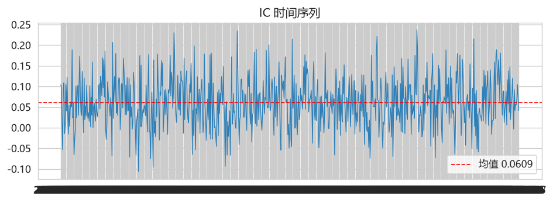

### 2. Six-Stage Factor Refinery (Industrial Pipeline)

An end-to-end factor production line modeled after industrial smelting:

| Stage | Process | Component | Purpose |
|-------|---------|-----------|---------|
| PART-01 | Ore Warehouse | `FeatureForge` | 28 raw features + 50+ time-series/cross-sectional factor pools, multi-process parallel construction |
| PART-02 | Mining Layer | `TransformerEncoder` + `FactorRLSearch` + LLM | Transformer (d_model=128, 2 layers, 5 heads) vectorization + MaskablePPO factor combination search + LLM vein exploration |
| PART-03 | Grinding Workshop | `RPNEngine` | Rank IC/IR/ICIR quantification + stability assessment + parallel batch evaluation |
| PART-04 | Three-Tier Screening | `Screener` | LASSO de-redundancy → Human-AI collaborative review → TOP 10% cutoff |
| PART-05 | Alloy Blending | `AlphaPool` | ICIR-weighted + orthogonalization synthesis + leave-one-out overfitting test |
| PART-06 | Methodology Report | `MethodologyReport` | Automated methodology report (build logic/parameter justification/cross-validation), one-click MD + JSON export |

**运行结果图例（六阶段精炼厂 UI）**：

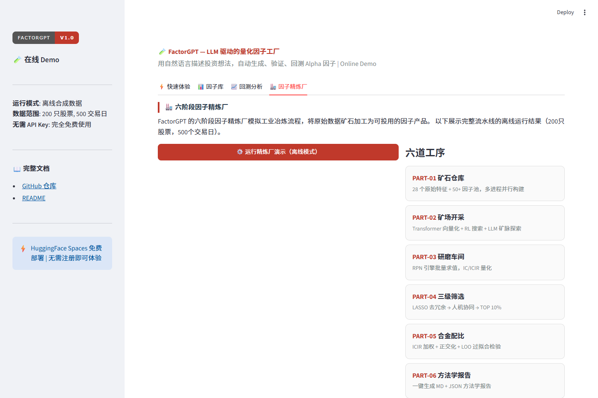

### 3. 62 Built-in Traditional Factors

A ready-to-use factor library covering five categories. Each factor includes name, category, tags, formula (Markdown + LaTeX), and reference Pandas implementation code. Supports search by category/keyword and batch export.

**运行结果图例（内置因子库五大类分布 + 因子 IC 排行）**：

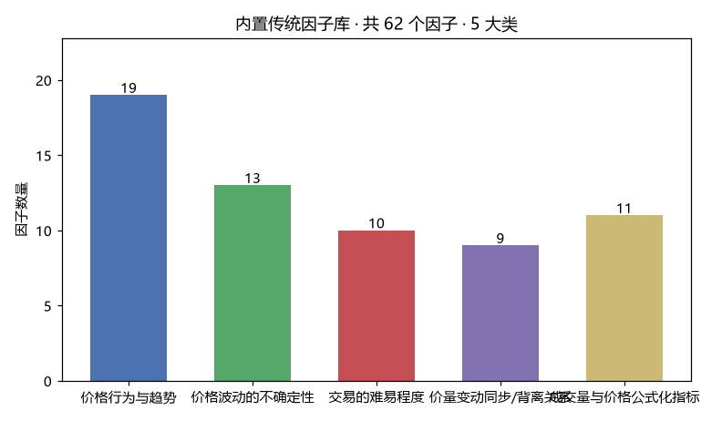
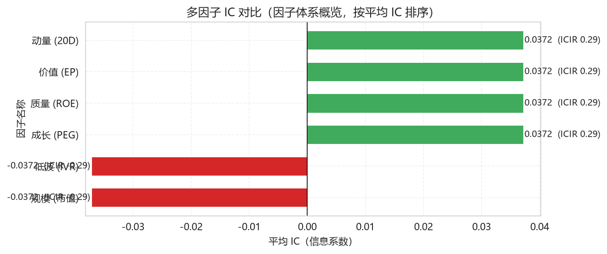

### 4. Enhanced Genetic Programming

Introduces three enhancements over traditional GP: **Factor Clusters** (maintain intra-cluster diversity), **Island Model** (multi-population independent evolution with periodic elite migration), and **Event Windows** (market-condition-triggered factor recombination/elimination). Built-in 15 operators (arithmetic, comparison, time-series, cross-sectional ranking).

**运行结果图例（因子簇/岛屿演化结果）**：

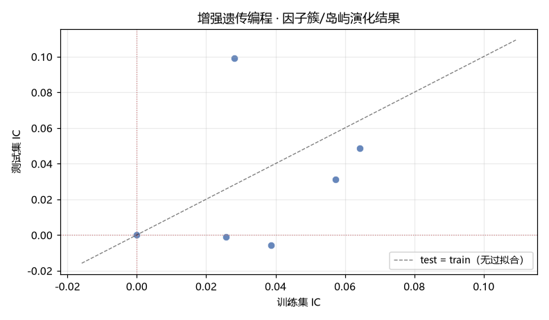

### 5. Unstructured Data Factor Mining

Extracts Alpha signals from multi-modal text data: `TextAnalyzer` (tokenization, entity recognition, sentiment quantification), `AlternativeDataManager` (supply chain, sentiment, satellite text), and `UnstructuredFactorIntegrator` (fusion with structured factors, incremental information contribution evaluation).

**运行结果图例（文本情绪量化 + 主题标签）**：

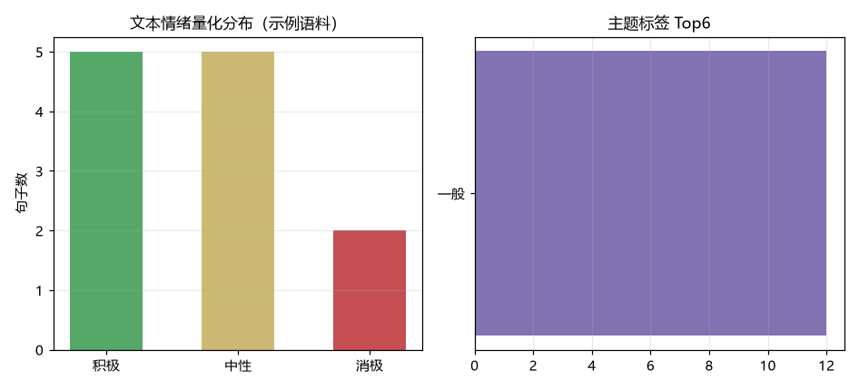

### 6. Transformer-Agent Deep Coupling

Deeply couples Transformer vector representations with the Agent's cognitive loop: `TransformerCoupling`, `CouplingScheduler`, `AgentContextBuilder`, and `AttentionVisualizer` form a "perception → reasoning → action" closed loop, significantly enhancing factor discovery depth and interpretability.

### 7. Local Deployment & Offline Resilience

- **Ollama Integration**: One-click script switches to local LLM (qwen2.5-coder:7b, llama3.1:8b, etc.) — no API key needed
- **Kronos Integration**: Financial time-series forecasting model as predictive factor enhancement
- **Graceful Degradation**: All heavy dependencies (Transformer, RL, ChromaDB) auto-degrade to numpy/heuristic/keyword fallbacks, ensuring zero-dependency-offline operation
- **Preflight Check**: Built-in health check script for conference presentation readiness
- **Data Caching**: Multi-source auto-fallback (EastMoney → Sina → Tushare → THS → Synthetic), with local cache for complete offline operation

**运行结果图例（内置离线数据源覆盖概览）**：

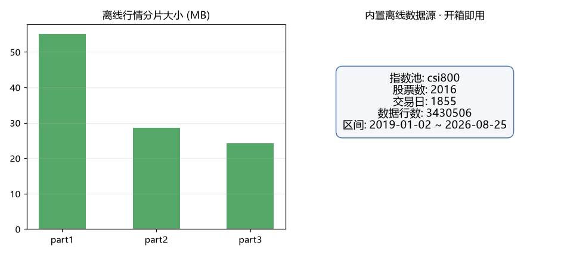

### 8. Research Report Knowledge Pipeline (Tencent ima Integration)

FactorGPT keeps its factor knowledge base fresh by continuously watching a live sell-side research library through the Tencent **ima** open API. Three scripts under `scripts/` cover the full loop:

| Script | Role | Cost per run |
|--------|------|--------------|
| `ima_sync.py` | Pulls documents from **your own** ima knowledge base, chunks them, and feeds `data/knowledge/**/chunks.jsonl` + ChromaDB so the Agent can retrieve them | Depends on library size |
| `ima_keyword_watch.py` | **Lightweight watcher (recommended).** Runs `search_knowledge` against a curated keyword list and reports only reports that are new relative to a saved baseline | ~14-28 API calls |
| `ima_subscription_track.py` | **Full directory snapshot.** Walks the entire folder tree of a subscribed library and diffs it against the previous manifest | 350+ paged calls, resumable |

The watcher is the practical entry point. Against a 17,837-document subscribed research library, a full enumeration needs 350+ paged requests and reliably trips the account-level rate limit (`220021`), whereas keyword-targeted search costs roughly one request per keyword and finishes in seconds. Keyword selection matters: precise research terms such as `选股因子` or `量化择时` return a handful to a couple dozen documents, while broad category words such as `ETF` or `期权` return 100+ per page and drown the signal.

```bash
# First run: establish the baseline without reporting everything as "new"
python scripts/ima_keyword_watch.py --init --no-push

# Daily run: report only genuinely new reports, then commit and push the manifest
python scripts/ima_keyword_watch.py

# Adjust the watchlist
python scripts/ima_keyword_watch.py --add-keyword 因子拥挤度
```

Outputs land in `ima_subscription/`: `watch_keywords.json` (watchlist), `keyword_seen.json` (baseline), `keyword_hits.csv` (flat index), and `keyword_watch.md` (append-only log of new arrivals). Both scripts tolerate rate limiting by backing off and checkpointing, and `ima_subscription_track.py` resumes from the last completed folder on the next run instead of restarting the crawl.

Credentials go in `.env` as `IMA_CLIENT_ID` and `IMA_API_KEY` (issued at `ima.qq.com/agent-interface`, valid for one month). Note the API boundary: subscribed/shared libraries allow search but deny full-text export (`get_media_info` returns `220030`), so copying a report into your own library remains a manual step in the ima client — the pipeline reduces that to ticking items off a change list rather than browsing 17k documents.

**运行结果图例（关键词命中统计，真实 CSV 累计 155 条）**：

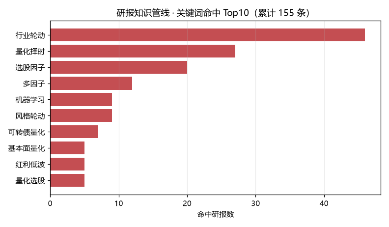

---

## Architecture Overview

```
┌─────────────────────────────────────────────────────────┐
│                   Streamlit Web UI (17 Pages)            │
├─────────────────────────────────────────────────────────┤
│  Factor Mining Agent (LangGraph)                         │
│  Retrieve → Generate → Validate → Evaluate → Reflect     │
├─────────────────────────────────────────────────────────┤
│  Six-Stage Factor Refinery Pipeline                      │
│  Ore → Mining → Grinding → Screening → Blending → Report │
├───────────────┬──────────────────┬────────────────────────────┤
│  LLM Layer    │  Data Layer      │  Engine Layer               │
│  DeepSeek     │  AKShare         │  Sandbox (Subprocess)       │
│  OpenAI       │  Tushare         │  Backtester (IC/Quantile)   │
│  Ollama       │  Sina/THS        │  RPN Engine                 │
│  vLLM         │  Baostock        │  Genetic Programming        │
│               │  MX Miaoxiang    │                             │
│               │  NeoData         │                             │
├───────────────┴──────────────────┴────────────────────────────┤
│  Knowledge Base: ChromaDB + BGE Embeddings + 62 Factors   │
│  Experiment Tracking: MLflow / Local JSONL                │
└─────────────────────────────────────────────────────────┘
```

---

## Screenshots & Visualizations

### Backtest Analysis Charts

<p align="center">
  
  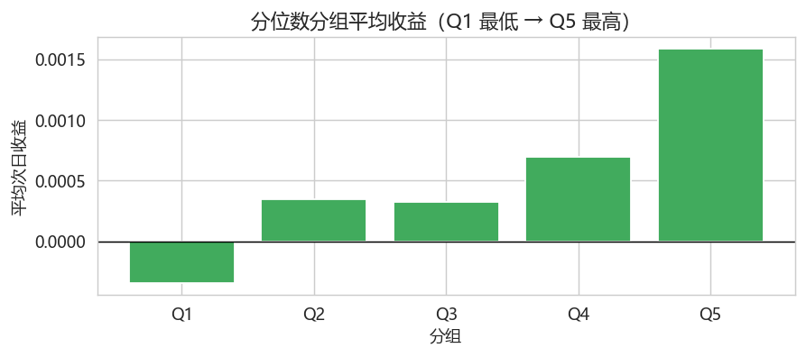
</p>

<p align="center">
  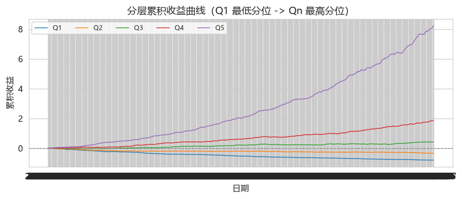
  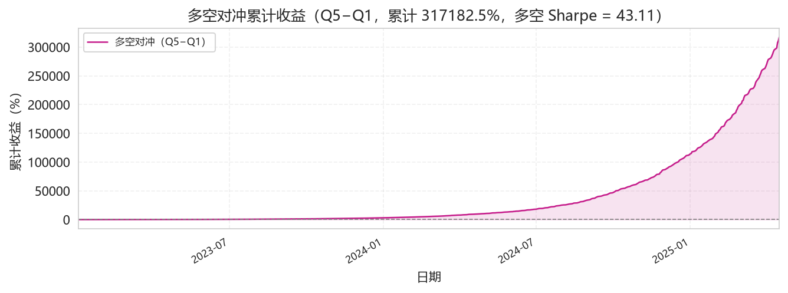
</p>

<p align="center">
  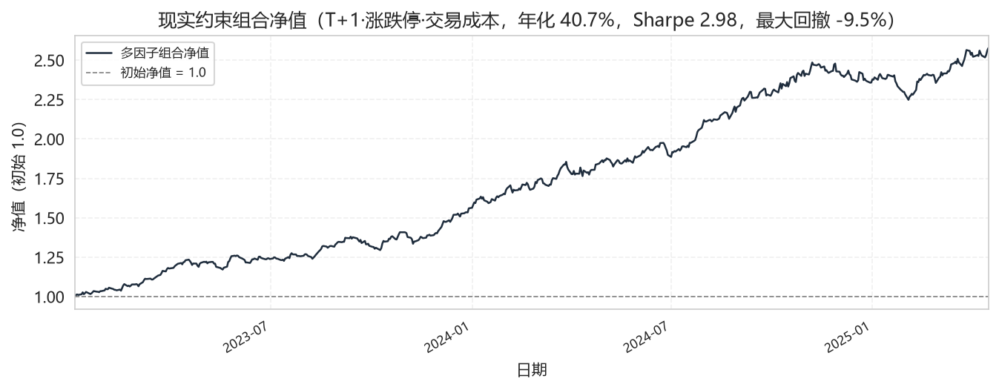
  
</p>

### Web Interface Screenshots

<p align="center">
  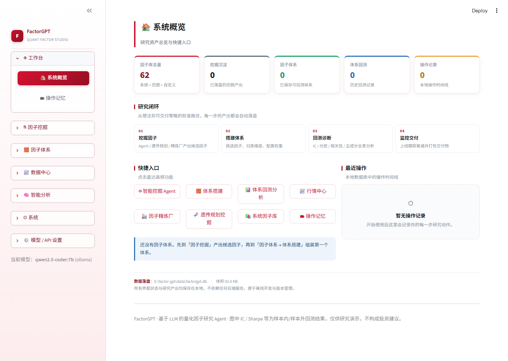
  
</p>

<p align="center">
  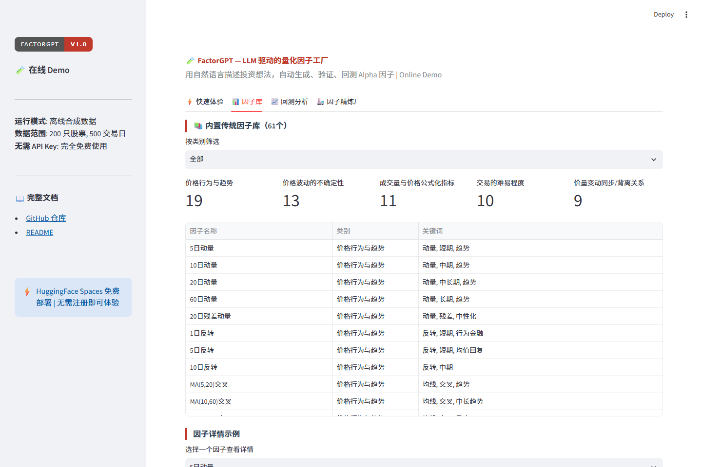
  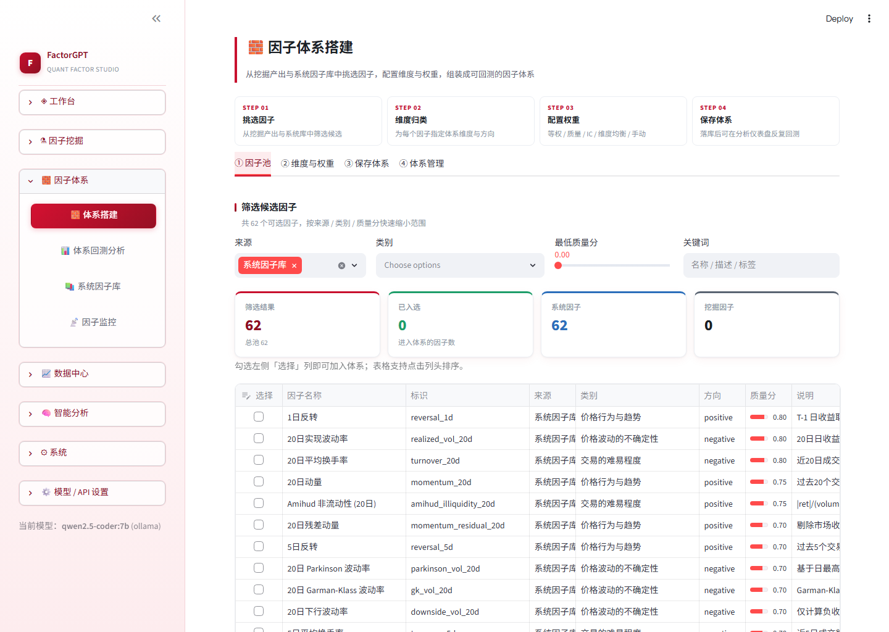
</p>

### Quick Demo Output (one-command simulation)

`python demo_sim.py` 一键模拟端到端因子流水线，输出 `demo_output/` 下 4 张真实回测图：IC 时间序列、分位数收益、多空累计、分层累计。

<p align="center">
  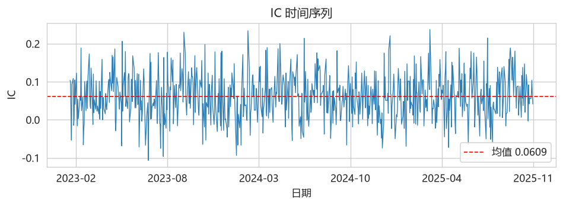
  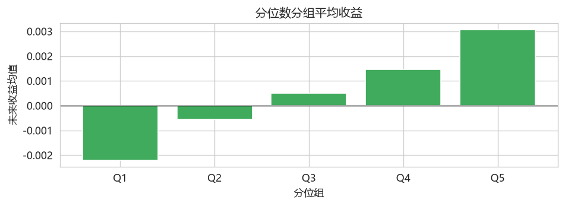
</p>

<p align="center">
  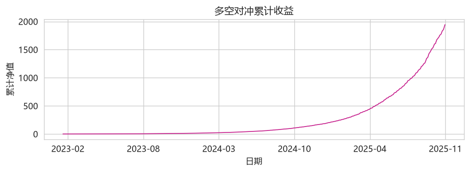
  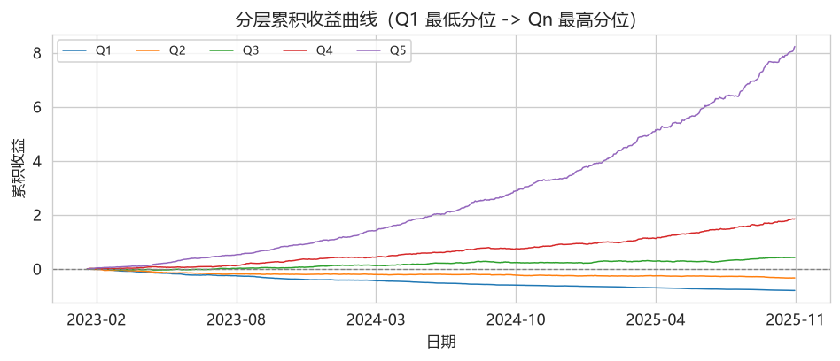
</p>

---

## Environment Requirements

| Requirement | Minimum | Recommended |
|-------------|---------|-------------|
| Python | 3.11 | 3.12+ |
| RAM | 8 GB | 16 GB |
| Disk Space | 3 GB | 5 GB (with model weights) |
| GPU | Not required | CUDA-compatible GPU for Transformer/RL |
| OS | Linux / macOS / Windows | Ubuntu 22.04+ |

### Optional Dependencies

- **LLM Backend**: Ollama (local), DeepSeek API, OpenAI API, or any OpenAI-compatible endpoint
- **Data Sources**: AKShare (free, no registration), Tushare Pro (free token), Baostock (free), EastMoney MX Miaoxiang API (key required), NeoData (platform service)
- **Heavy Modules**: PyTorch (Transformer encoder), stable-baselines3 + sb3-contrib (MaskablePPO), MLflow (experiment tracking) — all auto-degrade if missing

---

## Docker Deployment

### One-Click Start

```bash
# Clone and start
git clone https://github.com/ZXTLQQ/FactorGPT.git
cd FactorGPT
docker-compose up -d
```

### Build from Source

```bash
docker build -t factorgpt:latest .
docker run -d -p 8501:8501 --name factorgpt factorgpt:latest
```

### Docker Compose Configuration

The included `docker-compose.yml` provides:
- Persistent volume for data cache and ChromaDB
- Environment variable configuration for API keys and data sources
- Automatic port mapping (8501 for Streamlit)
- Resource limits (4GB memory, 2 CPU cores)

### Environment Variables

| Variable | Description | Default |
|----------|-------------|---------|
| `DEEPSEEK_API_KEY` | DeepSeek API key | - |
| `TUSHARE_TOKEN` | Tushare Pro token | - |
| `FACTORGPT_LLM_PROVIDER` | Override LLM provider | ollama |
| `FACTORGPT_LLM_MODEL` | Override LLM model | qwen2.5-coder:7b |
| `HF_ENDPOINT` | HuggingFace mirror endpoint | https://hf-mirror.com |
| `MX_APIKEY` | EastMoney Miaoxiang (妙想) API key, see "EastMoney MX" section | - |
| `IMA_CLIENT_ID` | Tencent ima client ID for the research-report pipeline | - |
| `IMA_API_KEY` | Tencent ima API key (renew monthly at ima.qq.com/agent-interface) | - |

---

## Sample Data

The repository includes sample data and can generate synthetic data for offline demonstration:

- **Synthetic Data**: Automatically generated with controlled signal-to-noise ratio for testing and CI
- **Real Data**: Use `python scripts/prefetch_data.py` to pull real A-share market data (CSI 800 constituents, daily frequency, 2019-2024)
- **Factor Library**: `data/learned_factors.jsonl` — a growing library of learned and imported factors
- **Vibe-Trading Catalog**: `data/vibe_trading_alpha_catalog.json` — natural language Alpha signal reference catalog
- **Research Watchlist**: `ima_subscription/keyword_hits.csv` — auto-maintained index of matched sell-side research reports

---

## Project Structure

```
FactorGPT/
├── src/
│   ├── agent/          # LangGraph Agent (graph, nodes, state, integration)
│   ├── engine/         # Factor builder, backtester, optimizer, traditional factors
│   ├── data/           # Data fetcher, cleaner, feature forge
│   ├── pipeline/       # Six-stage refinery pipeline
│   ├── rag/            # Knowledge base (ChromaDB + retrieval)
│   ├── llm/            # LLM client (DeepSeek/OpenAI/Ollama compatible)
│   ├── ui/             # Streamlit web interface (17 pages)
│   ├── store/          # SQLite persistence (memory, chat, experiments)
│   └── kronos/         # Kronos financial forecasting model integration
├── scripts/            # Utilities (data prefetch, health check, mx_query, ima sync/watch)
├── factorgpt-skill/    # Agent skill packages (SKILL.md + official EastMoney MX skills)
│   └── skills/         # mx-data / mx-search / mx-xuangu / mx-zixuan / mx-moni / mx-poster
├── third_party/        # Third-party integrations (kronos, ima client)
├── hf_space/           # HuggingFace Spaces static hosting files
├── docs/assets/                 # Documentation screenshots and charts
├── data/               # Sample data, factor library, experiment tracking
├── ima_subscription/   # Research-report watchlist, baseline, and change log
├── 文档归档/           # Archived reference docs (e.g., EastMoney MX API reference)
├── config.yaml         # Main configuration file
├── run_agent.py        # CLI entry point
├── Dockerfile          # Docker build file
├── docker-compose.yml  # Docker Compose orchestration
├── requirements.txt    # Python dependencies
└── requirements.lock.txt  # Locked dependencies with hashes (reproducible)
```

---

## Configuration

All settings are centralized in `config.yaml`:

- **llm**: Model provider (deepseek/openai/qwen/ollama), API key, endpoint, temperature, multi-LLM routing
- **data**: Primary data source (akshare/tushare/sina), date range, caching, synthetic fallback
- **backtest**: Quantile count, commission rate, risk-free rate, chart output
- **rag**: Vector store toggle (ChromaDB+BGE or jieba fallback), embedding model, HF mirror
- **agent**: Max iterations, IC threshold, OOS validation
- **refinery**: Six-stage pipeline configuration (Transformer, RL, screening, AlphaPool)
- **proxy**: HTTP/HTTPS proxy for mainland China network environments
- **experiment_tracking**: Experiment logging (local JSONL or MLflow)
- **data.source**: `legacy`（默认，本地 akshare/sina/tushare 自爬）、`neodata`（平台稳定数据源，见下节）或 `offline`（仓库内置的本地离线数据，不触网，见下节）

---

## NeoData Stable Data Source (Experimental)

FactorGPT can optionally route all market-data calls through the platform's **NeoData** service instead of self-crawling akshare/sina/tushare. The switch is unified behind a factory in `src/data/neo_adapter.py` (`get_data_source()`), so the four call sites (`graph.py`, `refinery.py`, `factor_system.py`, `market_data.py`) are unchanged and the **local `legacy` scheme is fully preserved** by default.

- **How to enable**: set `data.source: neodata` in `config.yaml`. The real gateway `base_url` is already filled in `config.yaml` (`data.neodata.base_url`).
- **Authentication**: requires the platform-scoped `tempToken`, which the platform writes to `~/.workbuddy/.neodata_token` (or the `NEODATA_TOKEN` env var). An ordinary IDE session token will be rejected with HTTP 401.

> **Important limitation — `fallback_to_legacy` must stay `true`.** NeoData is a **natural-language query** service: it returns free-text answer blocks (`data.apiData.apiRecall[].content`), **not** a structured bulk-data API. It therefore cannot reliably provide the structured datasets the factor engine needs — full daily-K-line time series (backtest core), complete index-constituent lists, industry/market-cap mappings, and structured financial statements. The adapter's `neo()` parsers are best-effort and return empty for these, so `fallback_to_legacy` is required to keep backtests runnable. In practice `neodata` currently serves only as a research-Q&A aid and **does not replace `legacy` for factor backtesting**. Live field validation was also blocked in this environment because the platform `tempToken` was not available (session token → 401). Revisit turning `fallback_to_legacy` off only after a valid `tempToken` is obtainable and structured parsing is proven.

---

## Offline Data Source (built-in, no network)

For a **fully offline** environment (no internet, flaky akshare/sina feeds, or deterministic backtesting), FactorGPT ships with a built-in local market dataset under `data/offline/` — cloned straight from the repository, no setup required. It is read through the `OfflineDataSource` adapter (`src/data/offline_adapter.py`), behind the same `get_data_source()` factory as `legacy`/`neodata` — so all four call sites (`graph.py`, `refinery.py`, `factor_system.py`, `market_data.py`) work unchanged.

- **How to enable**: set `data.source: offline` in `config.yaml` (default).
- **Data files** (bundled, commit-tracked): `data/offline/bars_<index>_part*.parquet` (daily bars, sharded so each file stays under 100 MB), `constituents_<index>.json`, `meta.json` (trade range, symbol/row counts). The default pool is `csi800` (~2016 symbols, 2019-01 ~ 2026-08, ~3.43M rows). After cloning, the dataset is ready to use — no download, no API key.
- **What it provides**: daily K-line (qfq-adjusted), index constituents, pct_chg — aligned with the `DataFetcher` column contract (`date/symbol/open/high/low/close/volume/amount/pct_chg`).
- **What it does not provide**: industry/market-cap/financial/news fields, so neut/alternative-data dimensions degrade gracefully to empty — the factor pipeline still runs on pure price-volume data.
- **Rebuilding locally**: if you ever need to refresh or extend the bundled dataset, the maintainer can regenerate it from a local market-data library; end users never need to — the bundled files are ready to use.
- **UI**: the sidebar "数据源设置" panel has an `offline` option plus a live status readout (trade range, symbol/row counts from `meta.json`).


---

## EastMoney MX (妙想) Data Interface

An official supplement to the NeoData channel: the EastMoney "Miaoxiang" (妙想) open API provides six data capabilities — market/fundamental queries (`data`), news & research search (`search`), smart stock screening (`xuangu`), watchlist management (`zixuan`), simulated portfolio (`moni`), and financial community content (`poster`). It is a reliable replacement for fragile self-crawled akshare/sina feeds.

- **Skill packages**: bundled at `factorgpt-skill/skills/mx-*/` (official releases, one `SKILL.md` + script per package). API reference: https://marketing.dfcfw.com/res/download/A620260623NIYC2U.md
- **API key (never commit it)**: set `MX_APIKEY` in your local `.env` (git-ignored) or as a persistent env var (`setx MX_APIKEY "..."` on Windows). The committed `.env.example` keeps `MX_APIKEY=` empty for users to fill in themselves.
- **Usage**: the cross-platform wrapper `scripts/mx_query.py` injects the key automatically and writes outputs to `output/mx_data/`:

```bash
python scripts/mx_query.py data "上证指数今日行情"
python scripts/mx_query.py search "白酒板块研报"
python scripts/mx_query.py xuangu "市盈率低于10的银行股"
python scripts/mx_query.py --list
```

> The official scripts default to a Linux output path (`/root/.openclaw/workspace/mx_data/output/`); on Windows either pass an explicit output dir or use the `mx_query.py` wrapper.

---

## Offline & Conference-Ready

FactorGPT is designed for reliable offline demonstrations:

```bash
# Step 1: Prefetch real data (with network)
python scripts/prefetch_data.py

# Step 2: Run health check
python scripts/preflight_check.py --offline

# Step 3: Disconnect network and run
streamlit run src/ui/app.py
python run_agent.py --refinery "Momentum + Quality factors"
```

The system checks five risk categories: RL dependencies, local Ollama models, cached market data, ChromaDB availability, and sandbox stability — all with clear pass/fail/warn outputs.

---

## Roadmap

- [ ] Multi-market support (US stocks, Hong Kong stocks, crypto)
- [ ] Real-time factor monitoring dashboard with alerting
- [ ] Factor decay analysis and lifecycle management
- [ ] Collaborative factor review workflow
- [ ] REST API for programmatic factor mining
- [ ] Integration with backtesting frameworks (Zipline, Backtrader)

---

## Contributing

Contributions are welcome! Please see the issues page for open tasks or submit a pull request with your improvements.

---

## License

This project is licensed under the MIT License. See the [LICENSE](LICENSE) file for details.

---

## Disclaimer

FactorGPT is an academic research tool for quantitative finance education and research purposes. It does not constitute financial advice. All factor outputs, backtest results, and investment signals are for reference only. Past performance does not guarantee future results. Users should make independent investment decisions based on their own risk tolerance and due diligence.

---

<p align="center">
  <b>FactorGPT</b> — Where Natural Language Meets Quantitative Finance<br>
  <sub>Built with ❤️ for the quantitative finance community</sub>
</p>
